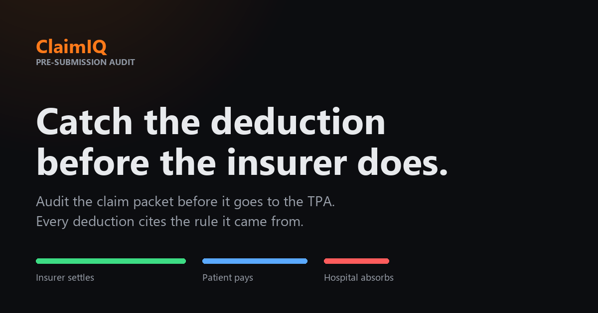

# ClaimIQ

ClaimIQ is a pre-submission audit tool for Indian hospital insurance claims. It reviews a claim packet, identifies likely deductions, cites the relevant policy rule, and separates the bill into three outcomes: estimated insurer settlement, patient liability, and hospital write-off.



> [!IMPORTANT]
> ClaimIQ produces estimates, not insurance adjudications. The bundled rule corpus is an unverified snapshot, and every claim in this repository is synthetic. Do not use the project with real patient data without completing a security, privacy, and regulatory review.

## What ClaimIQ does

ClaimIQ helps a hospital billing team review a claim before submitting it to an insurer:

- Extracts line items from native and scanned hospital bills
- Classifies payable and non-payable charges against a searchable rule corpus
- Cites the rule used for each deduction
- Calculates settlement, patient liability, and hospital write-off with deterministic decimal arithmetic
- Detects missing documents and inconsistent claim data
- Verifies totals and citations before producing the result
- Stores audit results for claim history, leakage analysis, recovery modelling, and batch review
- Generates an audit report for human review

The application can run without a language model. Set `AI_ENABLED=false` to use deterministic processing for local development and tests.

## How it works

```text
Claim packet
    |
    v
Extract and normalize bill items
    |
    v
Retrieve policy and non-payable rules
    |
    v
Classify charges with cited evidence
    |
    v
Calculate settlement and deductions
    |
    v
Verify totals, citations, and consistency
    |
    v
Audit result, report, and portfolio analytics
```

The language model handles document interpretation and rule-grounded explanations. Python tools handle monetary calculations, validation, persistence, and reporting. This separation keeps every rupee calculation reproducible.

## Architecture

| Layer | Technology | Responsibility |
|---|---|---|
| API and audit engine | Python, FastAPI, LangGraph | Ingestion, extraction, classification, calculation, verification, and reporting |
| Primary frontend | Next.js, React, TypeScript | Claim review, history, dashboards, rules, recovery, batches, and traces |
| Bundled interface | HTML, CSS, JavaScript | Single-process local and container demo served by FastAPI |
| Analyst interface | Streamlit | Alternative data and trace exploration interface |
| Storage | SQLite | Claims, audit results, jobs, analytics, and audit ledger |
| Retrieval | BM25, dense embeddings, reciprocal rank fusion | Policy and non-payable rule search |

The main backend package is `claimiq/`. The Next.js application is in `frontend/`, the bundled interface is in `web/`, and the Streamlit interface is in `ui/`.

## Run locally

ClaimIQ requires Python 3.12. The Next.js frontend also requires Node.js and npm.

Create the Python environment from Command Prompt or PowerShell:

```powershell
python -m venv .venv
.\.venv\Scripts\python.exe -m pip install -r requirements.txt
copy .env.example .env
```

Add an API key to `.env` if you want language-model features. To run without an API key, set:

```dotenv
AI_ENABLED=false
```

Start the backend and bundled interface:

```powershell
.\start.ps1
```

Open the following local URLs:

- Product interface: `http://127.0.0.1:8000/app.html`
- API documentation: `http://127.0.0.1:8000/docs`
- Health check: `http://127.0.0.1:8000/health`

### Run the Next.js frontend

Start the API with `start.ps1`, then run the frontend in another terminal:

```powershell
cd frontend
npm install
npm run dev
```

Open `http://localhost:3000`. Add `http://localhost:3000` to `CLAIMIQ_CORS_ORIGINS` in `.env` if the frontend cannot connect to the API.

## Test the project

Run the backend tests without external model calls:

```powershell
$env:AI_ENABLED="false"
.\.venv\Scripts\python.exe -m pytest
```

Run the frontend checks:

```powershell
cd frontend
npm run lint
npm run typecheck
npm test
npm run build
```

## Project structure

```text
claimiq/      Backend, audit graph, retrieval, tools, and persistence
frontend/     Next.js product interface
web/          Bundled interface served by FastAPI
ui/           Streamlit analyst interface
corpus/       Policy and non-payable rule corpus
data/         Synthetic samples, evaluation data, traces, and seeded demo data
scripts/      Indexing, seeding, evaluation, and asset-generation utilities
tests/        Backend test suite
docs/         Implementation and deployment documentation
```

## Deployment

The current deployment design uses the Next.js frontend on Vercel and the FastAPI backend on Render. See [DEPLOY.md](DEPLOY.md) for configuration and environment variables.

The repository includes a seeded synthetic database and an embedding cache for the hosted demo. Replace this deployment approach before processing private or regulated data.

## Evaluation

The repository includes reproducible evaluations for retrieval, classification, and bill extraction:

- [Retrieval evaluation](RETRIEVAL.md)
- [Classification evaluation](CLASSIFICATION.md)
- [Extraction evaluation](EXTRACTION.md)
- [Evaluation methodology and limitations](EVALUATION.md)

These results use synthetic or hand-labelled project data. They do not establish performance on real hospital claims.

## Security and responsible use

- Keep `.env`, provider credentials, and API keys out of Git
- Use only synthetic data with the default configuration
- Enable authentication and tenant isolation before any public deployment
- Review the rule corpus against current insurer documents and applicable regulations
- Treat every result as decision support for a qualified human reviewer
- Do not treat projected settlement as a guarantee of insurer payment

ClaimIQ is a technical demonstration and is not medical, legal, financial, or insurance advice.
